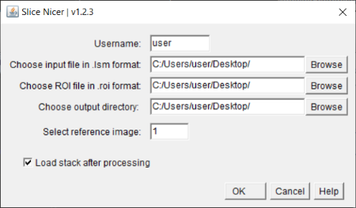

# SliceNicer

SliceNicer is an ImageJ macro for normalization of time lapse images against a t0 reference image

## Content

- Content
- [Screenshot](#Screenshot)
- [Usage](#Usage)
- [Getting started](#Getting-started)
    - [Notes](#Notes)
    - [Download](#Download)
    - [Installation](#Installation)

## Screenshot

## Usage

1. Import `.lsm` file (containing the timelapse) into ImageJ
2. Choose a line ROI which represents the image (e.g. 1000px length and 1000px width) and save it via the ROI manager as .roi file
3. Note which image should be used as reference for normalisation
Close all windows except the main ImageJ window.
4. You should now have two files
    - the `.lsm` file
    - the `.roi` file
5. Open the macro via <kbd>Plugins > SliceNicer_v#.#.#</kbd>
6. Adjust settings:
    - Username: the username of the user who is logged on to the computer
    - Input file: the present `.lsm` file
    - ROI file: the present `.roi` file
    - Output directory: the directory where the export folder containing all output files will be created (if the default directory is chosen, the folder content will be overwritten with each application)
    - Reference image: the number of the previously noted reference image (for the first image: 1)
    - Load stack after processing: Keeping this checked is recommended, this will:
        - load all normalized images as hyperstack
        - save the hyperstack as `.tiff` file
        - create timelapse videos of all channels of the hyperstack

## Getting started 

### Notes

- The input file must be in `.tiff` format or any other TIFF dependent format (e.g. `.lsm`)
- The fiji-installer only works with Fiji, not with plain ImageJ

### Download

<a href="https://github.com/danielbarleben/SliceNicer/releases/download/v1.2.5/SliceNicer_v1.2.5.zip">SliceNicer_v1.2.5.zip - September 7, 2022 - 3.45 KB</a>

### Installation via fiji-installer.bat (windows only)

1. Download the latest macro version using the download link (see above)
2. Extract the `.zip` file
3. Run the `fiji-installer.bat` to copy the file to the correct location and delete deprecated versions
4. Restart ImageJ
5. The macro can now be found under Plugins (at the bottom of the dropdown menu)

### Manual installation
1. Download the latest macro version using the download link (see above)
2. Extract the `.zip` file
3. Open ImageJ or Fiji
4. Go to <kbd>Plugins > Install...</kbd> and select the extracted `SliceNicer_#.#.#.ijm` file.
5. Restart ImageJ
6. The macro can now be found under Plugins (at the bottom of the dropdown menu)

